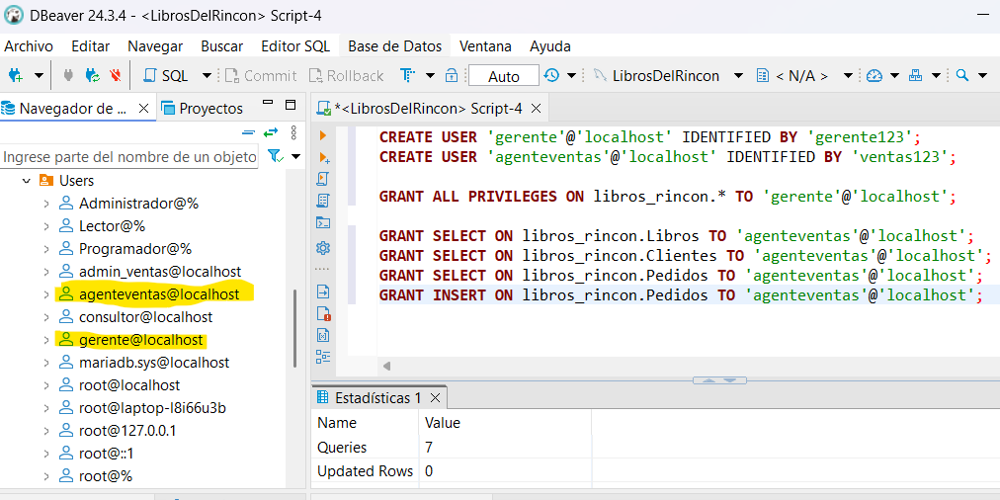
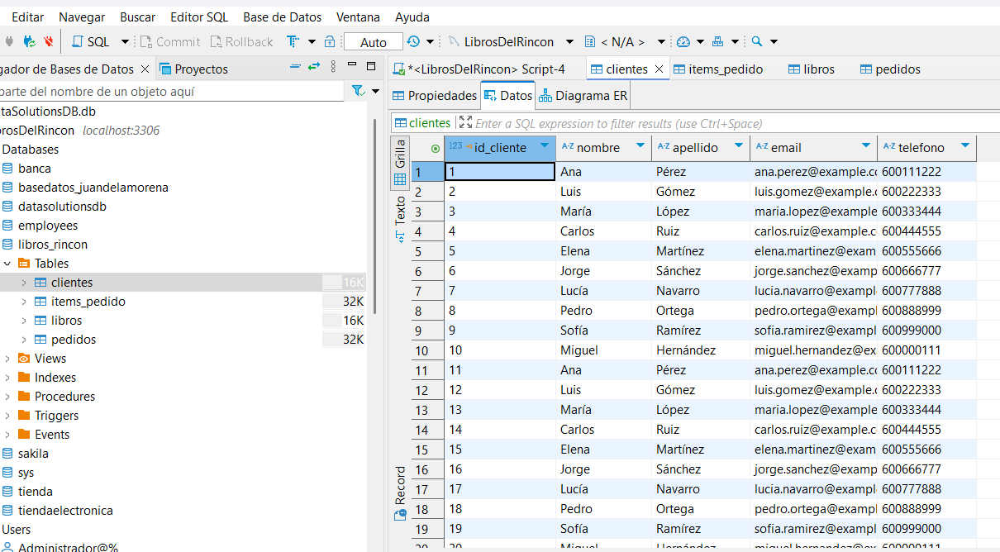
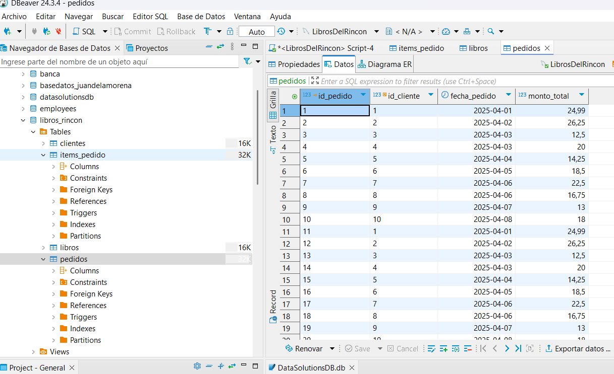
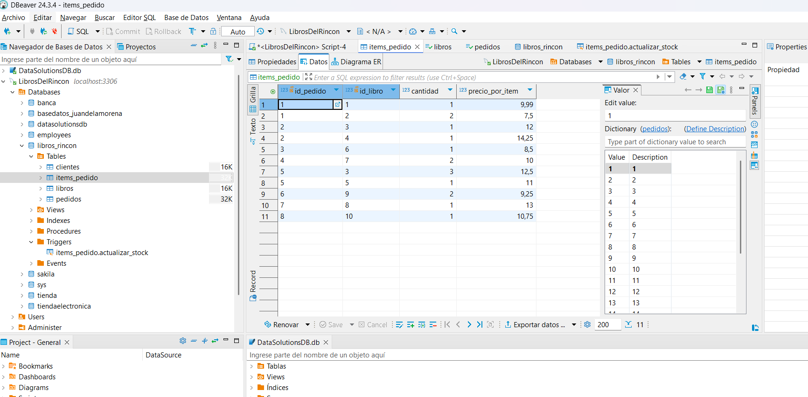
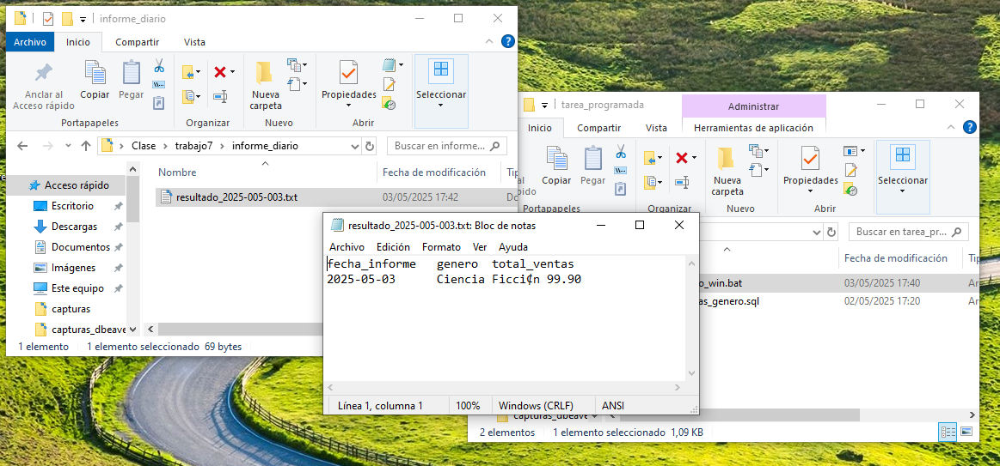
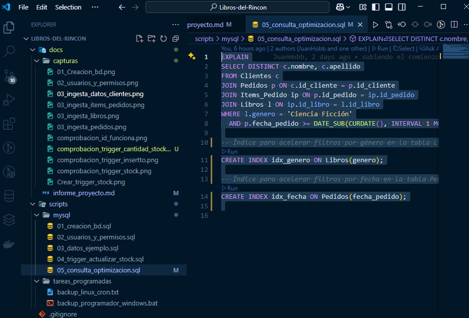

<div class="cover">
  <div class="cover-container">
    <h1 class="cover-title">Informe Final del Proyecto Práctico</h1>
    <h2 class="cover-subtitle">Administración y Automatización de Base de Datos</h2>
    <h3 class="cover-topic">"Libros del Rincón"</h3>
    <div class="cover-author">
      <strong>Autor:</strong> Juan de la Morena Marzalo<br>
      <strong>Asignatura:</strong> UF1468 / UF1469 / UF1470
    </div>
    <div class="cover-date">
      Fecha de entrega: 05/05/2025
    </div>
  </div>
</div>

<div style="page-break-after: always;"></div>
<!-- TOC:BEGIN -->
## Índice

- [Índice](#índice)
- [Creación de la Base de Datos y Gestión de Usuarios (UF1469)](#creación-de-la-base-de-datos-y-gestión-de-usuarios-uf1469)
- [Introducción de Datos (UF1469)](#introducción-de-datos-uf1469)
- [Automatización de Tareas (UF1470)](#automatización-de-tareas-uf1470)
  - [Trigger de stock](#trigger-de-stock)
  - [Informe diario de ventas (Windows)](#informe-diario-de-ventas-windows)
  - [Informe diario de ventas (Linux – cron)](#informe-diario-de-ventas-linux--cron)
  - [Script Python para creación de pedidos](#script-python-para-creación-de-pedidos)
- [Optimización de Consultas (UF1470)](#optimización-de-consultas-uf1470)
- [Planificación de Backups (UF1468)](#planificación-de-backups-uf1468)
- [Dificultades y Conclusiones](#dificultades-y-conclusiones)
- [Anexos](#anexos)

<div style="page-break-after: always;"></div>

# Introducción

Este documento recoge el desarrollo completo del proyecto práctico para la librería online **“Libros del Rincón”**. Incluye:

- Diseño del esquema relacional y justificación de diseño.
- Crear base de datos y usuarios con permisos.
- Inserción de datos de ejemplo.
- Automatización con trigger, scripts `.bat`, `cron` y Python.
- Optimización de consultas con `EXPLAIN` e índices.
- Planificación de backups diarios.

<div style="page-break-after: always;"></div>

# Diseño de la Base de Datos (UF1468)

Se utilizó **MySQL**. El esquema consta de:

```sql

CREATE DATABASE IF NOT EXISTS libros_rincon;
USE libros_rincon;

CREATE TABLE Libros(
  id_libro INT PRIMARY KEY AUTO_INCREMENT,
  titulo VARCHAR(255) NOT NULL,
  autor VARCHAR(255) NOT NULL,
  genero VARCHAR(100) NOT NULL,
  precio DECIMAL(6,2) NOT NULL,
  cantidad_en_stock INT NOT NULL
);

CREATE TABLE Clientes(
  id_cliente INT PRIMARY KEY AUTO_INCREMENT,
  nombre VARCHAR(100) NOT NULL,
  apellido VARCHAR(100) NOT NULL,
  email VARCHAR(255) NOT NULL UNIQUE,
  telefono VARCHAR(20)
);

CREATE TABLE Pedidos(
  id_pedido INT PRIMARY KEY AUTO_INCREMENT,
  id_cliente INT NOT NULL,
  fecha_pedido DATE NOT NULL,
  monto_total DECIMAL(8,2) NOT NULL,
  FOREIGN KEY(id_cliente) REFERENCES Clientes(id_cliente)
);

CREATE TABLE Items_Pedido(
  id_pedido INT NOT NULL,
  id_libro INT NOT NULL,
  cantidad INT NOT NULL,
  precio_por_item DECIMAL(6,2) NOT NULL,
  PRIMARY KEY(id_pedido,id_libro),
  FOREIGN KEY(id_pedido) REFERENCES Pedidos(id_pedido),
  FOREIGN KEY(id_libro) REFERENCES Libros(id_libro)
);
```

**Justificación:** autoincrement, integridad referencial, tipos adecuados.


**Captura:**


<div style="page-break-after: always;"></div>

## Creación de la Base de Datos y Gestión de Usuarios (UF1469)

```sql
-- scripts/mysql/02_usuarios_y_permisos.sql
CREATE USER 'gerente'@'localhost' IDENTIFIED BY 'Gerente123';
GRANT ALL PRIVILEGES ON libros_rincon.* TO 'gerente'@'localhost';

CREATE USER 'agenteventas'@'localhost' IDENTIFIED BY 'Ventas123';
GRANT SELECT ON libros_rincon.Libros TO 'agenteventas'@'localhost';
GRANT SELECT ON libros_rincon.Clientes TO 'agenteventas'@'localhost';
GRANT SELECT, INSERT ON libros_rincon.Pedidos TO 'agenteventas'@'localhost';
```

<div style="page-break-after: always;"></div>

**Captura:**


<div style="page-break-after: always;"></div>

## Introducción de Datos (UF1469)

```sql
-- scripts/mysql/03_datos_ejemplo.sql
INSERT INTO Libros (...) VALUES ...;
INSERT INTO Clientes (...) VALUES ...;
INSERT INTO Pedidos (...) VALUES ...;
INSERT INTO Items_Pedido (...) VALUES ...;
```

**Explicación:** ejemplo de 10 filas en cada tabla respetando FKs.

**Capturas:**

- 
- 
- 
- 

<div style="page-break-after: always;"></div>

## Automatización de Tareas (UF1470)

### Trigger de stock

```sql
-- scripts/mysql/04_trigger_actualizar_stock.sql
DELIMITER //
CREATE TRIGGER actualizar_stock AFTER INSERT ON Items_Pedido
FOR EACH ROW BEGIN
  UPDATE Libros
    SET cantidad_en_stock = cantidad_en_stock - NEW.cantidad
    WHERE id_libro = NEW.id_libro;
END;//
DELIMITER ;
```

**Capturas:**

- 

<div style="page-break-after: always;"></div>

- 

<div style="page-break-after: always;"></div>

### Informe diario de ventas (Windows)

```bat
:: scripts/tareas_programadas/06_informe_ventas_diario.bat
@echo off
for /f "tokens=2 delims==" %%i in ('wmic os get localdatetime /value') do set dt=%%i
set fecha=!dt:~0,4!-!dt:~4,2!-!dt:~6,2!
mysql -u USR -pPWD libros_rincon ^
  < scripts/mysql/06_informe_diario_ventas.sql > informes/ventas_%fecha%.txt
```

```sql
-- scripts/mysql/06_informe_diario_ventas.sql
SELECT CURDATE() AS fecha_informe, l.genero, SUM(ip.cantidad*ip.precio_por_item) total_ventas
FROM Items_Pedido ip
JOIN Libros l ON ip.id_libro=l.id_libro
JOIN Pedidos p ON ip.id_pedido=p.id_pedido
WHERE p.fecha_pedido=CURDATE()
GROUP BY l.genero;
```

**Capturas:**

- 

<div style="page-break-after: always;"></div>

- 

<div style="page-break-after: always;"></div>

### Informe diario de ventas (Linux – cron)

```bash
# scripts/tareas_programadas/07_cron_informe_ventas.sh
#!/bin/bash
date=$(date +"%F")
mysql -u USR -pPWD libros_rincon < scripts/mysql/06_informe_diario_ventas.sql > informes/ventas_$date.txt
```

```cron
0 8 * * * /ruta/07_cron_informe_ventas.sh
```

### Script Python para creación de pedidos

```python
# scripts/python/crear_pedido.py
import mysql.connector

def obtener_precio(id_libro, cursor):
    cursor.execute("SELECT precio FROM Libros WHERE id_libro=%s",(id_libro,))
    return cursor.fetchone()[0]

def crear_pedido(id_cliente,id_libro,cantidad):
    db=mysql.connector.connect(user='USR',password='PWD',host='localhost',database='libros_rincon')
    cur=db.cursor()
    precio=obtener_precio(id_libro,cur)
    monto=precio*cantidad
    cur.execute("INSERT INTO Pedidos(id_cliente,fecha_pedido,monto_total) VALUES(%s,CURDATE(),%s)",(id_cliente,monto))
    pid=cur.lastrowid
    cur.execute("INSERT INTO Items_Pedido VALUES(%s,%s,%s,%s)",(pid,id_libro,cantidad,precio))
    db.commit();cur.close();db.close()
```

<div style="page-break-after: always;"></div>

## Optimización de Consultas (UF1470)

```sql
-- scripts/mysql/05_consulta_optimizacion.sql
EXPLAIN SELECT DISTINCT c.nombre,c.apellido
FROM Clientes c
JOIN Pedidos p ON c.id_cliente=p.id_cliente
JOIN Items_Pedido ip ON p.id_pedido=ip.id_pedido
JOIN Libros l ON ip.id_libro=l.id_libro
WHERE l.genero='Ciencia Ficción'
  AND p.fecha_pedido>=DATE_SUB(CURDATE(),INTERVAL 1 MONTH);

CREATE INDEX idx_genero ON Libros(genero);
CREATE INDEX idx_fecha ON Pedidos(fecha_pedido);
```

**Captura:**


<div style="page-break-after: always;"></div>

## Planificación de Backups (UF1468)

```bat
:: scripts/tareas_programadas/backup_windows.bat
@echo off
set fecha=%date:~6,4%-%date:~3,2%-%date:~0,2%
mysqldump -u USR -pPWD libros_rincon > backups/backup_%fecha%.sql
```

```cron
0 2 * * * mysqldump -u USR -pPWD libros_rincon > /ruta/backups/backup_$(date +\%F).sql
```

**Capturas:**

- 

  <div style="page-break-after: always;"></div>

- 

<div style="page-break-after: always;"></div>

## Dificultades y Conclusiones

- Configurar rutas y formato de fecha en scripts batch.
- Integridad referencial en inserciones masivas.
- Ajuste de CSS para saltos de página en PDF.

**Conclusión:** flujo completo y documentado, listo para implementación real.

<div style="page-break-after: always;"></div>

## Anexos

- Estructura de carpetas:

  ```
  libros_rincon/
    .vscode/
      settings.json
    scripts/
      mysql/
        01_creacion_bd.sql scripts/mysql/02_usuarios_y_permisos.sql scripts/mysql/03_datos_ejemplo.sql scripts/mysql/04_trigger_actualizar_stock.sql scripts/mysql/05_consulta_optimizacion.sql scripts/mysql/06_informe_diario_ventas.sql
      tareas_programadas/
        backup_programador_windows.bat
        informe_venta.bat
        informe_ventas_genero.sql
      python/
        crear_pedido.py
    docs/
      capturas/
      cover.css
      pdf.css
      informe_final.md
      informe_final.pdf
  ```

- Repositorio: [https://github.com/tu_usuario/LIBROS-DEL-RINCON](https://github.com/tu_usuario/LIBROS-DEL-RINCON)
