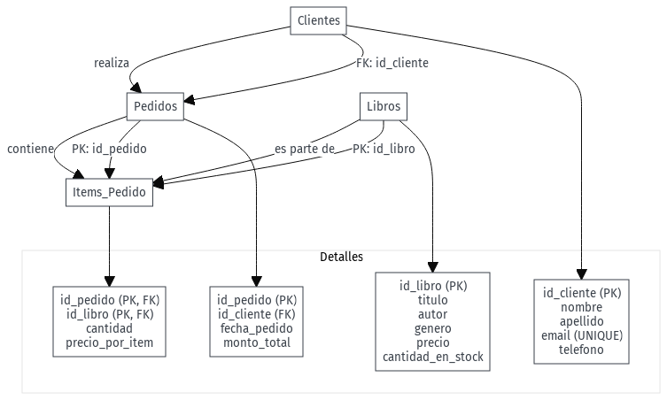
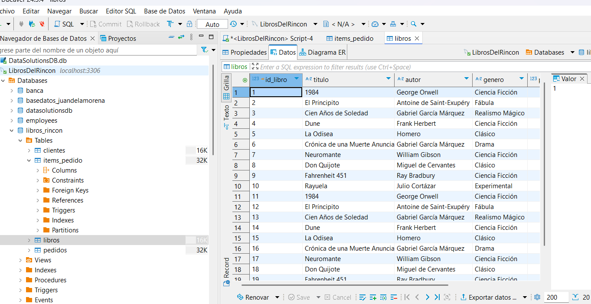
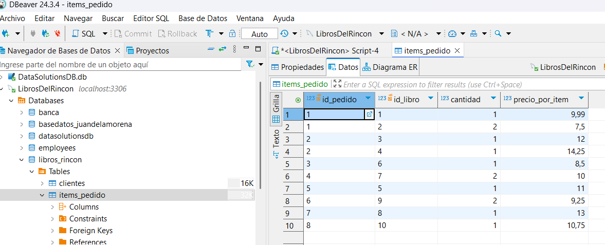

<div class="cover">
  <div class="cover-container">
    <h1 class="cover-title">Informe Final del Proyecto Práctico</h1>
    <h2 class="cover-subtitle">Sistema Integral de Gestión de Librería</h2>
    <h3 class="cover-topic">"Libros del Rincón"</h3>
    <div class="cover-details">
      <div class="cover-author">
        <strong>Autor:</strong> Juan de la Morena Marzalo<br>
        <strong>Tutor:</strong> Alberto Mozo<br>
        <strong>Centro:</strong> Urko formaciones<br>
      </div>
      <div class="cover-info">
        <strong>Asignatura:</strong> Administración y Automatización de Bases de Datos<br>
        <strong>Códigos:</strong> UF1468 / UF1469 / UF1470<br>
        <strong>Curso Académico:</strong> 2024/2025
      </div>
    </div>
    <div class="cover-date">
      Fecha de entrega: 05 de Mayo de 2025
    </div>
  </div>
</div>

<div style="page-break-after: always;"></div>
<!-- TOC:BEGIN -->
## Índice

- [Índice](#índice)
- [Contexto del Proyecto](#contexto-del-proyecto)
- [Objetivos Cumplidos](#objetivos-cumplidos)
- [Metodología](#metodología)
- [Estructura del Documento](#estructura-del-documento)
- [Modelo Entidad-Relación](#modelo-entidad-relación)
- [Decisiones Clave de Diseño](#decisiones-clave-de-diseño)
- [Script de Creación Completo](#script-de-creación-completo)
- [Creación de la Base de Datos y Gestión de Usuarios (UF1469)](#creación-de-la-base-de-datos-y-gestión-de-usuarios-uf1469)
- [Introducción de Datos (UF1469)](#introducción-de-datos-uf1469)
- [Automatización de Tareas (UF1470)](#automatización-de-tareas-uf1470)
  - [Trigger de stock](#trigger-de-stock)
  - [Informe diario de ventas (Windows)](#informe-diario-de-ventas-windows)
  - [Script Python para creación de pedidos](#script-python-para-creación-de-pedidos)
- [Optimización de Consultas (UF1470)](#optimización-de-consultas-uf1470)
- [Planificación de Backups (UF1468)](#planificación-de-backups-uf1468)
  - [Script de Backup Automático (Windows)](#script-de-backup-automático-windows)
    - [Automatización de Backup - Programador de Tareas de Windows](#automatización-de-backup---programador-de-tareas-de-windows)
    - [1. Apertura del Programador de tareas](#1-apertura-del-programador-de-tareas)
    - [2. Creación de una nueva tarea básica](#2-creación-de-una-nueva-tarea-básica)
    - [3. Configuración de la frecuencia](#3-configuración-de-la-frecuencia)
    - [4. Programación de la hora de ejecución](#4-programación-de-la-hora-de-ejecución)
    - [5. Selección de la acción](#5-selección-de-la-acción)
    - [6. Revisión y finalización](#6-revisión-y-finalización)
    - [Observaciones Importantes](#observaciones-importantes)
- [Dificultades y Conclusiones](#dificultades-y-conclusiones)
- [Anexos](#anexos)
<!-- TOC:END -->

<div style="page-break-after: always;"></div>

# Introducción

## Contexto del Proyecto

"Libros del Rincón" es una librería independiente que requiere modernizar su sistema de gestión. Este proyecto implementa una solución completa que abarca:

- Gestión centralizada de inventario
- Automatización de procesos clave
- Generación de informes estratégicos
- Sistema de backups robusto

## Objetivos Cumplidos

✔ Diseño de base de datos relacional normalizada  
✔ Implementación de seguridad por roles  
✔ Sistema de actualización automática de stock  
✔ Mecanismos de optimización de consultas  
✔ Solución multiplataforma (Windows/Linux)

## Metodología

El desarrollo siguió una aproximación por fases:

1. **Análisis**: Requisitos y modelado conceptual
2. **Implementación**: Scripts SQL y automatización
3. **Pruebas**: Validación de triggers y scripts
4. **Documentación**: Capturas y explicación técnica

## Estructura del Documento

Este informe se organiza en 8 secciones que reflejan el flujo de trabajo desarrollado, desde el diseño inicial hasta las conclusiones finales.

<div style="page-break-after: always;"></div>

# Diseño de la Base de Datos (UF1468)

## Modelo Entidad-Relación



## Decisiones Clave de Diseño

1. **Normalización**:

   - 3FN para evitar redundancias
   - Relaciones muchos-a-muchos mediante tabla intermedia

2. **Tipos de Datos**:

   - `DECIMAL` para precisión monetaria
   - `VARCHAR` con longitudes ajustadas a necesidades reales

3. **Restricciones**:

   - Claves primarias autoincrementales
   - `NOT NULL` para datos obligatorios
   - Integridad referencial con `FOREIGN KEY`

4. **Índices Iniciales**:
   - Campos de búsqueda frecuente
   - Claves foráneas para joins eficientes

## Script de Creación Completo

```sql
-- [01_creacion_bd.sql](http://_vscodecontentref_/0)
-- Incluye ENGINE y CHARSET explícitos
CREATE DATABASE IF NOT EXISTS libros_rincon
  DEFAULT CHARACTER SET utf8mb4
  COLLATE utf8mb4_unicode_ci;

USE libros_rincon;

CREATE TABLE Libros(
  id_libro INT PRIMARY KEY AUTO_INCREMENT,
  titulo VARCHAR(255) NOT NULL,
  autor VARCHAR(255) NOT NULL,
  genero VARCHAR(100) NOT NULL,
  precio DECIMAL(6,2) NOT NULL,
  cantidad_en_stock INT NOT NULL
);

CREATE TABLE Clientes(
  id_cliente INT PRIMARY KEY AUTO_INCREMENT,
  nombre VARCHAR(100) NOT NULL,
  apellido VARCHAR(100) NOT NULL,
  email VARCHAR(255) NOT NULL UNIQUE,
  telefono VARCHAR(20)
);

CREATE TABLE Pedidos(
  id_pedido INT PRIMARY KEY AUTO_INCREMENT,
  id_cliente INT NOT NULL,
  fecha_pedido DATE NOT NULL,
  monto_total DECIMAL(8,2) NOT NULL,
  FOREIGN KEY(id_cliente) REFERENCES Clientes(id_cliente)
);

CREATE TABLE Items_Pedido(
  id_pedido INT NOT NULL,
  id_libro INT NOT NULL,
  cantidad INT NOT NULL,
  precio_por_item DECIMAL(6,2) NOT NULL,
  PRIMARY KEY(id_pedido,id_libro),
  FOREIGN KEY(id_pedido) REFERENCES Pedidos(id_pedido),
  FOREIGN KEY(id_libro) REFERENCES Libros(id_libro)
);
```

**Justificación:** autoincrement, integridad referencial, tipos adecuados.


**Captura:**


<div style="page-break-after: always;"></div>

## Creación de la Base de Datos y Gestión de Usuarios (UF1469)

```sql
-- scripts/mysql/02_usuarios_y_permisos.sql
CREATE USER 'gerente'@'localhost' IDENTIFIED BY 'Gerente123';
GRANT ALL PRIVILEGES ON libros_rincon.* TO 'gerente'@'localhost';

CREATE USER 'agenteventas'@'localhost' IDENTIFIED BY 'Ventas123';
GRANT SELECT ON libros_rincon.Libros TO 'agenteventas'@'localhost';
GRANT SELECT ON libros_rincon.Clientes TO 'agenteventas'@'localhost';
GRANT SELECT, INSERT ON libros_rincon.Pedidos TO 'agenteventas'@'localhost';
```

<div style="page-break-after: always;"></div>

**Captura:**


<div style="page-break-after: always;"></div>

## Introducción de Datos (UF1469)

```sql
-- scripts/mysql/03_datos_ejemplo.sql
INSERT INTO Libros (...) VALUES ...;
INSERT INTO Clientes (...) VALUES ...;
INSERT INTO Pedidos (...) VALUES ...;
INSERT INTO Items_Pedido (...) VALUES ...;
```

**Explicación:** ejemplo de 10 filas en cada tabla respetando FKs.

**Capturas:**

- 
- 
- 
- 

<div style="page-break-after: always;"></div>

## Automatización de Tareas (UF1470)

### Trigger de stock

```sql
-- scripts/mysql/04_trigger_actualizar_stock.sql
DELIMITER //
CREATE TRIGGER actualizar_stock AFTER INSERT ON Items_Pedido
FOR EACH ROW BEGIN
  UPDATE Libros
    SET cantidad_en_stock = cantidad_en_stock - NEW.cantidad
    WHERE id_libro = NEW.id_libro;
END;//
DELIMITER ;
```

**Capturas:**

- 

<div style="page-break-after: always;"></div>

- 

<div style="page-break-after: always;"></div>

### Informe diario de ventas (Windows)

```bat
:: scripts/tareas_programadas/06_informe_ventas_diario.bat
@echo off
for /f "tokens=2 delims==" %%i in ('wmic os get localdatetime /value') do set dt=%%i
set fecha=!dt:~0,4!-!dt:~4,2!-!dt:~6,2!
mysql -u USR -pPWD libros_rincon ^
  < scripts/mysql/06_informe_diario_ventas.sql > informes/ventas_%fecha%.txt
```

```sql
-- scripts/mysql/06_informe_diario_ventas.sql
SELECT CURDATE() AS fecha_informe, l.genero, SUM(ip.cantidad*ip.precio_por_item) total_ventas
FROM Items_Pedido ip
JOIN Libros l ON ip.id_libro=l.id_libro
JOIN Pedidos p ON ip.id_pedido=p.id_pedido
WHERE p.fecha_pedido=CURDATE()
GROUP BY l.genero;
```

**Capturas:**

- 

<div style="page-break-after: always;"></div>

- 

<div style="page-break-after: always;"></div>

### Script Python para creación de pedidos

```python
# scripts/python/crear_pedido.py
import mysql.connector

def obtener_precio(id_libro, cursor):
    cursor.execute("SELECT precio FROM Libros WHERE id_libro=%s",(id_libro,))
    return cursor.fetchone()[0]

def crear_pedido(id_cliente,id_libro,cantidad):
    db=mysql.connector.connect(user='USR',password='PWD',host='localhost',database='libros_rincon')
    cur=db.cursor()
    precio=obtener_precio(id_libro,cur)
    monto=precio*cantidad
    cur.execute("INSERT INTO Pedidos(id_cliente,fecha_pedido,monto_total) VALUES(%s,CURDATE(),%s)",(id_cliente,monto))
    pid=cur.lastrowid
    cur.execute("INSERT INTO Items_Pedido VALUES(%s,%s,%s,%s)",(pid,id_libro,cantidad,precio))
    db.commit();cur.close();db.close()
```

<div style="page-break-after: always;"></div>

## Optimización de Consultas (UF1470)

```sql
-- scripts/mysql/05_consulta_optimizacion.sql
EXPLAIN SELECT DISTINCT c.nombre,c.apellido
FROM Clientes c
JOIN Pedidos p ON c.id_cliente=p.id_cliente
JOIN Items_Pedido ip ON p.id_pedido=ip.id_pedido
JOIN Libros l ON ip.id_libro=l.id_libro
WHERE l.genero='Ciencia Ficción'
  AND p.fecha_pedido>=DATE_SUB(CURDATE(),INTERVAL 1 MONTH);

CREATE INDEX idx_genero ON Libros(genero);
CREATE INDEX idx_fecha ON Pedidos(fecha_pedido);
```

**Captura:**


<div style="page-break-after: always;"></div>

## Planificación de Backups (UF1468)

### Script de Backup Automático (Windows)

Guárdalo como `tareas_programadas/backup_windows.bat`:

```bat
@echo off
REM Obtener la fecha y hora en formato compatible con nombres de archivo en Windows
for /f "tokens=2 delims==" %%i in ('wmic os get localdatetime /value') do set datetime=%%i
set fecha=%datetime:~0,4%-%datetime:~4,2%-%datetime:~6,2%
set hora=%datetime:~8,2%-%datetime:~10,2%-%datetime:~12,2%

REM Generar el nombre del archivo de backup
set nombre_backup=backup_%fecha%_%hora%.sql

REM Ejecutar el comando mysqldump y guardar el archivo
mysqldump -u root -pTuContraseña libros_rincon > "C:\backups\%nombre_backup%"
```

#### Automatización de Backup - Programador de Tareas de Windows

Una vez creado el script de copia de seguridad `backup_windows.bat`, se procedió a su automatización mediante el Programador de tareas de Windows.

#### 1. Apertura del Programador de tareas

- Se accede a **Programador de tareas** desde el menú Inicio de Windows.

#### 2. Creación de una nueva tarea básica

- Se selecciona la opción **Crear tarea básica**.
- Se asigna:
  - **Nombre**: `Backup automático base de datos`
  - **Descripción**: `Realiza automáticamente una copia de seguridad de la base de datos MySQL cada día.`

#### 3. Configuración de la frecuencia

- Se elige ejecutar la tarea **Diariamente**.

#### 4. Programación de la hora de ejecución

- Se establece una **hora fija** de ejecución diaria (por ejemplo, 20:00 h).

#### 5. Selección de la acción

- Se configura la tarea para **Iniciar un programa**.
- Se selecciona el archivo `backup_windows.bat` previamente creado.

#### 6. Revisión y finalización

- Se revisa el resumen de la tarea.
- Se pulsa en **Finalizar** para dejar programada la ejecución automática.

---

#### Observaciones Importantes

- El archivo `backup_windows.bat` debe tener permisos de ejecución adecuados.
- La contraseña de MySQL debe estar escrita en el script si se desea ejecución sin intervención manual.
- La tarea se ejecutará siempre que el equipo esté encendido a la hora programada.
- La copia de seguridad se almacenará en la ruta especificada en el `.bat` (`C:\backups\`).

---

## Dificultades y Conclusiones

- Configurar rutas y formato de fecha en scripts batch.
- Integridad referencial en inserciones masivas.
- Ajuste de CSS para saltos de página en PDF.

**Conclusión:** flujo completo y documentado, listo para implementación real.

<div style="page-break-after: always;"></div>

## Anexos

- Estructura de carpetas:

  ```
  libros_rincon/
    .vscode/
    scripts/
      mysql/
      python/
    docs/
      capturas/
      cover.css
      pdf.css
      informe_final.md
      informe_final.pdf
  ```

- Repositorio: [https://github.com/JuanHoob/Libros-del-Rincon](https://github.com/JuanHoob/Libros-del-Rincon)
